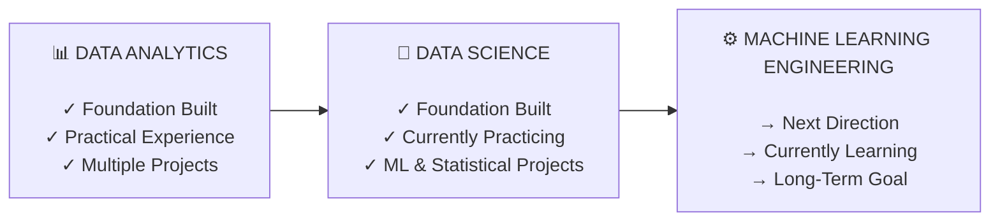

## Who I Am

I am **Mina Makram Riad**, a Statistics major at **Cairo University – Faculty of Economics and Political Science**, with a minor in **Social Science Computing**.

I am building my career around **data, statistics, machine learning, and intelligent systems**.

What interests me most about data is not simply finding numbers or training models. It is understanding **what the data is telling us, why a pattern exists, how reliable that conclusion is, and how it can be turned into something useful**.

---

## My Career Direction

My journey is progressing from **Data Analytics**, through **Data Science**, toward **Machine Learning Engineering**.

I am still early in this journey, but I approach that stage intentionally: building strong fundamentals, creating real projects, and continuously pushing myself toward more complex problems.

---

## My Journey

My journey started with **Statistics**.

Studying Statistics gave me a foundation in probability, quantitative reasoning, inference, and analytical thinking. But as I progressed, I became increasingly interested in what could be done when statistical thinking was combined with programming and technology.

That led me to **Python, SQL, Excel, Power BI, and data analysis**.

Instead of learning these tools only through isolated exercises, I started building projects with real datasets. I worked through the entire analytical process: cleaning messy data, exploring patterns, applying statistical methods, creating visualizations, and communicating conclusions.

From there, my interest naturally moved toward **Machine Learning**.

I began learning how models can discover relationships and patterns that are difficult to identify through traditional analysis alone. I explored regression, statistical modeling, feature engineering, model evaluation, clustering, and dimensionality reduction.

My projects gradually became more ambitious.

I moved from analyzing individual datasets to exploring questions such as **how countries differ economically and socially**, how variables interact, how populations can be grouped without predefined labels, and how machine learning can help reveal hidden structures in data.

Along the way, I also became interested in the engineering side of the field: **building structured projects, working with APIs, creating applications, documenting workflows, and exploring AI, NLP, LLMs, and RAG systems**.

This changed the way I think about my career.

I no longer want to only analyze data.

I want to eventually be able to **take a problem from raw data all the way to a reliable intelligent system**.

---

## What I Am Doing Now

I am currently focused on strengthening the foundations that will support my transition from **data analysis into data science and machine learning engineering**.

My current work combines:

* **Python & SQL** for data processing and analysis
* **Statistics** for understanding and validating patterns
* **Pandas & NumPy** for data manipulation
* **SciPy & Statsmodels** for statistical analysis
* **Scikit-learn** for machine learning
* **Matplotlib & Seaborn** for visualization
* **Power BI & Excel** for analytical reporting
* **PostgreSQL** for working with structured data
* **Streamlit** for turning analysis into interactive applications
* **KNIME** for data-processing workflows
* **Git & GitHub** for version control and project development

I am also expanding into **Machine Learning, NLP, LLM applications, RAG, APIs, and ML engineering concepts**.

Most importantly, I am learning by building.

My portfolio includes projects in:

**Data Analysis · SQL · Statistics · Business Intelligence · Machine Learning · Unsupervised Learning · NLP · AI**

Each project is part of the same objective: moving beyond simply knowing a tool and learning how to **use it to solve a problem**.

---

## What I Will Do & My Goals

My goal is to build a career where **statistics, data science, machine learning, and engineering come together**.

I see my development as a progression:

### 01 — Build Strong Foundations

Continue strengthening:

* Statistics
* Probability
* Mathematics
* Python
* SQL
* Data Analysis
* Data Visualization
* Business Intelligence

These foundations are important because advanced machine learning is only as strong as the understanding behind it.

### 02 — Become a Strong Data Scientist

I want to deepen my ability to:

* Build predictive models
* Engineer meaningful features
* Design experiments
* Evaluate models correctly
* Work with complex datasets
* Explain analytical results
* Translate real-world problems into data problems

### 03 — Move Toward Machine Learning Engineering

My long-term goal is to go beyond developing models and learn how to build **production-oriented ML systems**.

I want to develop skills in:

* ML pipelines
* APIs
* Deployment
* Model serving
* Software engineering
* Testing
* Monitoring
* Data pipelines
* Scalable ML architectures

Ultimately, I want to understand the complete lifecycle:

**Data → Analysis → Model → System → Deployment → Impact**

---

## The Goal Behind the Journey

I am not building this portfolio simply to show that I know Python, SQL, or Machine Learning.

I am building it to document the process of becoming someone who can **solve meaningful problems with data**.

My long-term goal is to become a **Machine Learning Engineer with strong foundations in Statistics and Data Science** — someone capable of understanding a problem statistically, solving it computationally, and turning the solution into a useful system.

**Learn deeply. Build continuously. Solve meaningful problems.**
