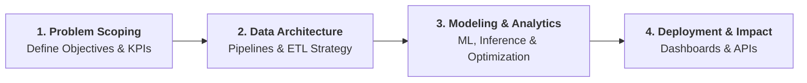

# Let's build something together

I am a **Data Scientist and Machine Learning Engineer** specializing in end-to-end data pipelines, statistical modeling, and AI-driven applications. 

Whether you need to transform complex raw datasets into production-grade pipelines, engineer predictive models, or implement LLM workflows, I bring structured analytical rigor and software engineering best practices to every project.

---

## How We Collaborate

Here is how I turn raw data challenges into scalable, production-ready systems:

---

### Contact Information

| Channel   | Contact Details | Action |
| :---   | :--- | :--- |
| **Email**   | `mina.makram.riad.111@gmail.com` | [:octicons-copy-16: Copy Email](#){ .md-button data-clipboard-text="mina.makram.riad.111@gmail.com" } |
| **Phone**   | `+20 127 100 4005` | [:octicons-copy-16: Copy Phone](#){ .md-button data-clipboard-text="+201271004005" } |
| **LinkedIn**   | Mina (Khela) Makram | [Connect](https://www.linkedin.com/in/mina-makram-32b342324/?locale=en){ .md-button } |
| **GitHub**   | Mina-Makram-001 | [View Repositories](https://github.com/Mina-Makram-001){ .md-button } |