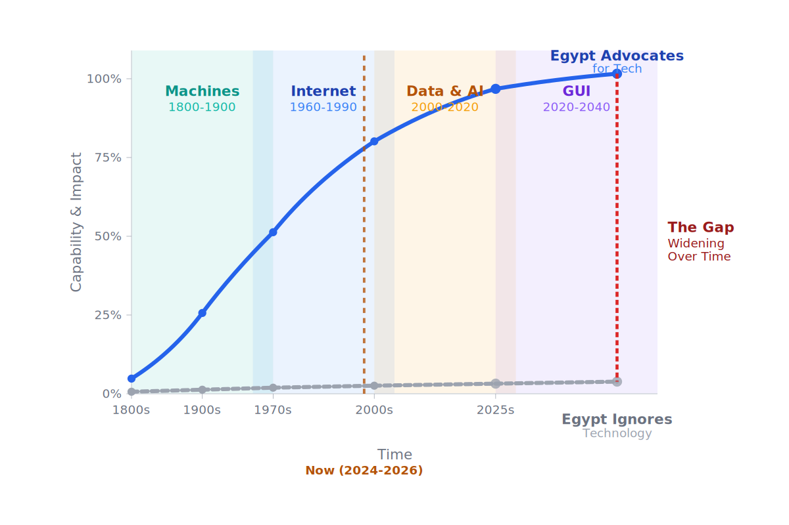

# Portfolio & CV Hub

Welcome to my professional portfolio, where you can explore my journey, projects, skills, and what I aim to build.

## Introduction

For thousands of years, humans have built tools to extend what we can do.

- **Writing extended memory.**
- **The printing press extended knowledge.**
- **Machines extended physical strength.**
- **Computers extended calculation.**
- **The Internet extended communication.**
- **And AI is beginning to extend cognition.**

With every technological revolution, the same fear often appears:

> **"Will this technology replace us?"**

---

Machines were once feared for replacing workers. Calculators and computers raised similar concerns about mathematicians and other professions.

 - **But history showed something different.**

Technology did not simply eliminate work — **it transformed it.** New industries, professions, and opportunities emerged for those who learned to work with the new technology.

 - **And this creates another pattern:**

Technology can accelerate exponentially, while adaptation can remain linear, creating a growing gap between those who embrace new technologies and those who fall behind. The real question is not simply who has access to technology, but **who learns to ride the wave**. AI presents the same opportunity. For Egypt, the question should not only be whether AI will change our future, but whether we will learn to use it, build with it, and become part of shaping that future.



---

## Where I Want to Contribute

```text
        DATA
     Raw Material
          ↓
   MACHINE LEARNING
      Mechanism
          ↓
 ARTIFICIAL INTELLIGENCE
      Next Wave
          ↓
       IMPACT
   What I Want to Build
```

## Discover more:

<div class="grid cards" markdown>

-   :material-account-details: **About Me**

    ---

    Learn more about my background, technical interests, and career objectives.

    [:octicons-arrow-right-24: Read About Me](ABOUT/about-me.md)

-   :material-briefcase-check: **Experience**

    ---

    Explore my past roles, practical experience, and hands-on technical work.

    [:octicons-arrow-right-24: View Experience](EXPERIENCE/experience.md)

-   :material-folder-account: **Projects**

    ---

    Detailed documentation for my data pipelines, analytics, and machine learning models.

    [:octicons-arrow-right-24: View Projects](PROJECTS/projects.md)

-   :material-code-tags: **Skills**

    ---

    Overview of my technical skills across Python, SQL, data tools, and analytics libraries.

    [:octicons-arrow-right-24: View Skills](SKILLS/skills.md)

-   :material-school: **Education**

    ---

    My academic background, continuous learning certifications, and key achievements.

    [:octicons-arrow-right-24: View Education](EDUCATION/education.md)

-   :material-email-outline: **Contact**

    ---

    Get in touch via LinkedIn, email, or view my public code repositories.

    [:octicons-arrow-right-24: Get in Touch](contact.md)

</div>