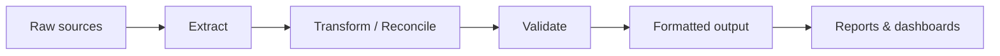

# KNIME Pipeline

Welcome to the documentation hub for the **company** KNIME data pipeline.
Everything here — workflows, screenshots, graphs, notebooks, and reference
material — is kept in one place and cross-linked so it can be maintained from a
single source (see [How-to → Add a new workflow](how-to/add-a-new-workflow.md)).

## Pipeline at a glance

## Where to start

-   :material-rocket-launch: **Getting started**

    ---

    Set up the environment and build the site locally.

    [:octicons-arrow-right-24: Getting started](getting-started/index.md)

-   :material-sitemap: **Workflows**

    ---

    One page per KNIME workflow, with its own assets.

    [:octicons-arrow-right-24: Browse workflows](workflows/index.md)

-   :material-book-open-variant: **Concepts**

    ---

    Shared ideas and conventions used across the pipeline.

    [:octicons-arrow-right-24: Concepts](concepts/index.md)

-   :material-tools: **How-to**

    ---

    Practical, repeatable procedures — including adding new features.

    [:octicons-arrow-right-24: How-to guides](how-to/index.md)

