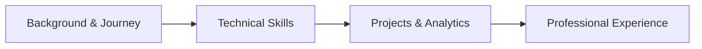

# Portfolio & CV Hub

Welcome to my personal documentation hub and professional portfolio. Here you can explore my background, experience, technical skills, projects, and educational journey.

## Quick Overview

-   :material-account-details: **About Me**

    ---

    Learn more about my background, technical interests, and career objectives.

    [:octicons-arrow-right-24: Read About Me](ABOUT/about-me.md)

-   :material-briefcase-check: **Experience**

    ---

    Explore my past roles, practical experience, and hands-on technical work.

    [:octicons-arrow-right-24: View Experience](EXPERIENCE/experience.md)

-   :material-folder-account: **Projects**

    ---

    Detailed documentation for my data pipelines, analytics, and machine learning models.

    [:octicons-arrow-right-24: View Projects](PROJECTS/projects.md)

-   :material-code-tags: **Skills**

    ---

    Overview of my technical skills across Python, SQL, data tools, and analytics libraries.

    [:octicons-arrow-right-24: View Skills](SKILLS/skills.md)

-   :material-school: **Education**

    ---

    My academic background, continuous learning certifications, and key achievements.

    [:octicons-arrow-right-24: View Education](EDUCATION/education.md)

-   :material-email-outline: **Contact**

    ---

    Get in touch via LinkedIn, email, or view my public code repositories.

    [:octicons-arrow-right-24: Get in Touch](contact.md)

